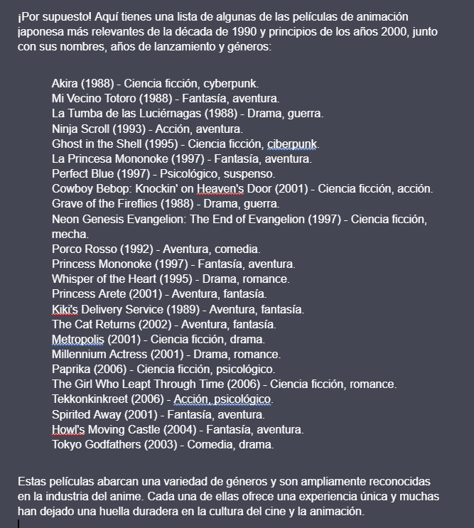
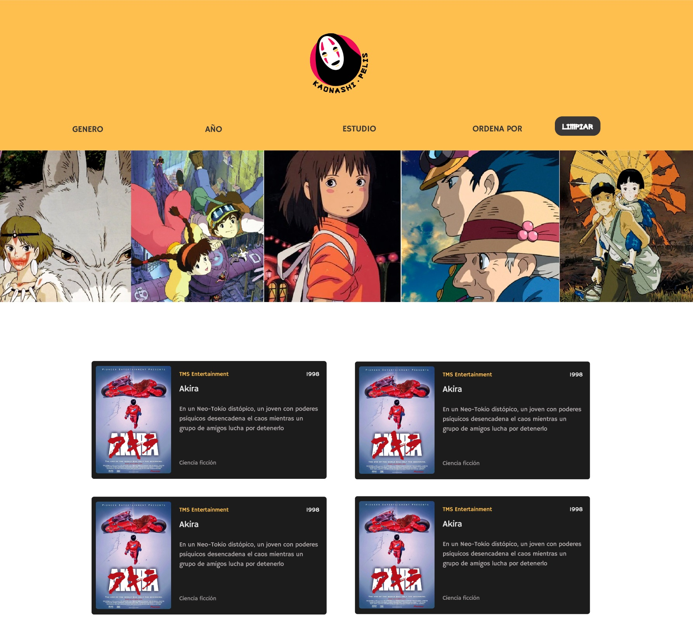

<h1>Dataverse</h1>

<h2>1. Introducción</h2>
<p>
  En este proyecto se construyó una página web para visualizar un conjunto (set) de
  datos que se generó con prompting, buscando que la página web se adecue a lo
  que el usuario necesita. Se utilizaron herramientas de inteligencia artificial
  como ChatGPT, ExplainDev, entre otras para generar un conjunto de datos en un
  archivo javascript. Como entregable final se creó una página web que permite
  visualizar la data, filtrar, ordenar y calcular alguna estadística. Inicio del
  proyecto Como primer paso en dupla identificamos el tema que centramos nuestro
  proyecto, el cual fue las películas de animación japonesas.
</p>
<br />


<p>Para poder identificar mejor nuestra navegación y la experiencia del usuario, respondimos las siguientes preguntas para identificar los principales aspectos de nuestro proyecto.</p>
<ul>
  <li>¿Quiénes son las principales usuarias del producto?</li>

  Personas que les guste las peliculas de animacion japonesa
  
  <li>¿Cuáles son los objetivos de estas usuarias en relación con el producto?</li>

    Identificar las distintas películas que existen según diferentes categorías
    (directorio)
  
  <li>¿Cuáles son los datos más relevantes que quieren ver en la interfaz y por qué?</li>

    El Título, Año, Edad recomendada para verla, Director, Género, Estudio de
    animación, entre otros, ya que de esta forma podrán filtrar según sus
    intereses o la información que tengan de alguna película en especial.


<p>Como referentes tenemos a Netflix<br>

</p>

<p>Y Amazon Prime<br>

</p>

<li>¿Cuándo utilizan o utilizarían el producto?</li>

Cuando quieran buscar información sobre alguna película en específico o quieran saber sobre más películas de algún género, director, año, etc. Dependiendo de sus intereses.

</ul>
<h2>2. Historias de Usuario</h2>

<h3>Historia de Usuario n° 1</h3>
<h4>Buscar información de una película</h4>
Como: Persona que le gusta las peliculas de animacion japonesa (usuario del sitio web)<br>
Quiero: Buscar información de una película.<br>
Para: Conocer los datos de la película.<br>
Descripción (conversación): Busca información sobre distintas películas de animación japonesa donde pueda enterarse sobre las características de ellas según sus intereses.<br>
<h4>Criterios de aceptación: </h4>
Deben tener el estándar de las características de las películas. <br>
Se debe visualizar la imagen de la película.<br>
Contar con jerarquía tipográfica.<br>
<h4>Definición de terminación</h4>
- Que las historias de usuarios sean funcionales, es decir, que si bien no cuente con su parte gráfica completa, pero que el usuario ya pueda ejecutarlas o interactuar con el sitio web según los criterios de aceptación anteriormente indicados.<br>
- Testeo con usuario, recopilando información de las opiniones para luego modificar aquellos parámetros que deban cambiarse y aplicar las sugerencias que indico el usuario.<br>
- Realizar las pruebas unitarias y que salgan aprobadas en su totalidad.<br>
<h3>Historia de Usuario n° 2</h3>
<h4>Filtrar por nombre</h4>
Como: Persona que le gusta las peliculas de animación japonesa<br>
Quiero: Filtrar por nombre, estudio de animación, año.<br>
Para: Buscar una película por el nombre, estudio de animación, año.<br>
Descripción (conversación): Busca una película con un nombre en especifico y para encontrarlo mas facil requiere de un filtro.<br>
<h4>Criterios de aceptación:</h4>
Se visualizan las opcion disponibles en la búsqueda por nombre<br>
La usuaria selecciona filtros por nombre<br>
La usuaria puede quitar la selección de filtro elegida anteriormente<br>
Las películas se organizan en el orden definido de inicio deshaciendo la selección de filtrado<br>
<h4>*Opcional:</h4>
Se visualizan las opcion disponibles en la búsqueda por año<br>
La usuaria selecciona filtros por año<br>
Se visualizan las opcion disponibles en la búsqueda por estudio de animación<br>
La usuaria selecciona filtros por estudio de animación<br>
<h4>Definición de terminación</h4>
- Que las historias de usuarios estén funcionales, es decir, que si bien no cuente con su parte gráfica completa, pero que el usuario ya pueda ejecutarlas o interactuar con el sitio web según los criterios de aceptación anteriormente indicados.<br>
- Testeo con usuario, recopilando información de las opiniones para luego modificar aquellos parámetros que deban cambiarse y se aplican las sugerencias que indico el usuario.<br>
- Que se realicen las pruebas unitarias y que salgan aprobadas en su totalidad.<br>
<h3>Historia de Usuario n° 3</h3>
<h4>Filtrar por ascendente y descendente</h4>
Como: Persona que le gusta las peliculas de animación japonesa<br>
Quiero: Agregar la opcion de poner ascendente y descente a un filtro seleccionado<br>
Para: Visualizar el contenido según el orden necesitado.<br>
Descripción (conversación): El usuario selecciona un orden en ascendente y descendente según sus criterios o sus necesidades para la búsqueda de las películas.
<h4>Criterios de aceptación: </h4>
Se visualizan las películas por la selección de ascendente o descendente dependiendo de la elección de la usuaria<br> 
La usuario puede seleccionar el filtro por ascendente y descendente<br>
La usuaria puede quitar la selección de filtro elegida anteriormente<br>
<h4>Definición de terminación</h4>
- Que las historias de usuarios estén funcionales, es decir, que si bien no cuente con su parte gráfica completa, pero que el usuario ya pueda ejecutarlas o interactuar con el sitio web según los criterios de aceptación anteriormente indicados.<br>
- Testeo con usuario, recopilando información de las opiniones para luego modificar aquellos parámetros que deban cambiarse y se aplican las sugerencias que indico el usuario.<br>
- Que se realicen las pruebas unitarias y que salgan aprobadas en su totalidad.<br>
<h3>Historia de Usuario n° 4</h3>
<h4>Filtrar por género</h4>
Como: Persona que le gusta las peliculas de animacion japonesa<br>
Quiero: Filtrar por género.<br>
Para: Buscar una película por un género en específico.<br>
Descripción (conversación): Busca una película con un genero en especifico haciendo uso de un filtro de búsqueda<br>
<h4>Criterios de aceptación: </h4>
Se visualizan las opcion disponibles en la busqueda por genero<br>
La usuaria selecciona filtros por género elegido<br>
La usuaria puede quitar la selección de filtro elegida anteriormente<br>
Las películas se organizan en el orden definido de inicio deshaciendo la selección de filtrado<br>
<h4>Definición de terminación</h4>
- Que las historias de usuarios estén funcionales, es decir, que si bien no cuente con su parte gráfica completa, pero que el usuario ya pueda ejecutarlas o interactuar con el sitio web según los criterios de aceptación anteriormente indicados.<br>
- Testeo con usuario, recopilando información de las opiniones para luego modificar aquellos parámetros que deban cambiarse y se aplican las sugerencias que indico el usuario.<br>
- Que se realicen las pruebas unitarias y que salgan aprobadas en su totalidad.<br>
<h3>Historia de Usuario n° 5</h3>
<h4>Visualmente agradable para el usuario</h4>
Como: Persona que le gusta las peliculas de animación japonesa<br>
Quiero: Sentirme cómodo en el sitio web / Consultar un sitio web que cuente con jerarquía visual<br>
Para: Visualizar el contenido y que sea de fácil acceso a las funciones<br>
Descripción (conversación): La usuaria ingresa al sitio web y debe ser entendible  tan pronto ingresa, para que así pueda navegar en él sin impedimentos.<br>
<h4>Criterios de aceptación: </h4>
Es intuitiva<br>
Cuenta con jerarquía visual<br>
La paleta de colores es agradable a la vista<br>
Cuenta con botones de cambio de estado <br>
La letra es legible.<br>
Es responsive <br>
<h4>Definición de terminación</h4>
- Testeo con usuario, recopilando información de las opiniones para luego modificar aquellos parámetros que deban cambiarse y se aplican las sugerencias que indico el usuario.<br>
- Que se realicen las pruebas unitarias y que salgan aprobadas en su totalidad.<br>
<h2>3. Prompting </h2>
Preguntas generadas a la IA: <br>
<p>Se hicieron una serie de consultas a IA para conseguir la data que se ocupo en el proyecto, adaptandolo al formato del dataset.js.</p>
Un ejemplo fue : "Tienes la informacion de las mejores peliculas de animacion japonesa en los años de 90s , podrías darme una lista de las 24 mejores peliculas de animacion japonesa de ese año?  <br>
Podrías darme esta información organizada de la siguiente manera: <br>
export default [
  {
    "id": "ada-lovelace",
    "name": "Ada Lovelace",
    "shortDescription": "Pionera de la informática, fue la primera programadora.",
    "description": "Una visionaria del siglo XIX ...",
    "imageUrl": "URL_DE_LA_IMAGEN_GENERADA",
    "facts": {
      "yearOfBirth": 1843,
      "placeOfBirth": "London, England",
      "mainField": "Computer Science",
    }
  },]"

<p>Listado de peliculas generado por la IA (usando ChatGPT y Bard)<br>

<br>
</p>

<h2>4. Prototipos</h2>

<p>Se hicieron prototipos acorde a las historias de usuarios identificadas con anterioridad, de esto se crearon un wireframe (prototipo en baja) y un mockup (prototipo en alta), donde pudimos identificar las diferentes caracteristicas graficas de nuestro proyecto.</p>
<p>Wireframe</p>
<br>
<p>Mockup trabajado en figma</p>
<br>

<h2>5. Consideraciones técnicas</h2>

<p>La lógica del proyecto esta implementada completamente en JavaScript
(ES6), HTML y CSS. En este proyecto se utilizo solo vanilla JavaScript.</p>

<p>El _boilerplate_ contiene una estructura de archivos así
como toda la configuración de dependencias:</p>

```text
.
├── README.md
├── package.json
├── src
|  ├── data
|  |  └── dataset.js (La que hayas generado con la IA)
|  ├── dataFunctions.js
|  ├── view.js
|  ├── index.html
|  ├── main.js
|  └── style.css
└── test
   └── data.js
   └── dataFunctions.spec.js
   └── tests-read-only

```

<p>El corazón de este proyecto es la manipulación de datos a través de arreglos
y objetos.<p>

<p>El proyecto tiene funcionalidades que corresponda
a obtener, procesar y manipular datos (funciones). Por ejemplo:</p>

<p>* `filterData(data, filterBy, value)`: esta función recibe tres parámetros.
  El primer parámetro, `data`, nos entrega los datos.
  El segundo parámetro, `filterBy`, nos dice con respecto a cuál de los campos de
  la data se quiere filtrar.
  El tercer parámetro, `value`, indica el valor de campo que queremos filtrar.</p>

<p>* `sortData(data, sortBy, sortOrder)`: esta función `sort` u ordenar
  recibe tres parámetros.
  El primer parámetro, `data`, nos entrega los datos.
  El segundo parámetro, `sortBy`, nos dice con respecto a cuál de los campos de
  la data se quiere ordenar.
  El tercer parámetro, `sortOrder`, indica si se quiere ordenar de manera
  ascendente o descendente.</p>

<p>* `computeStats(data)`: la función `compute` o calcular, nos permite hacer
  cálculos estadísticos básicos para ser mostrados de acuerdo a la data
  proporcionada, esta función debe usar el método reduce.</p>

  <p>Tambien el proyecto implementa manipulaciones del DOM a traves de archivos javascript, junto con la visualizacion de la data, proveniente del archivo dataset.js., filtros acumulativos entre unos a otros, un boton con la opcion de limpiar los filtros implementados, un buscador por nombre de las peliculas y utilizacion de las propiedades flexbox en el archivo css junto con una vision reponsiva del sitio para dispositivos moviles.</p>

<h2>6. Test Unitarios</h2>

<p>En este proyecto se crearon una serie de test unitarios de las funciones implementadas en el archivo dataFunctions.js. (filterBy, sortBy, etc.)</p><br>
<br>

<h2>7. Proyecto</h2>

<p>Finalmente, el proyecto se llevó a cabo en 5 sprints, cada uno con una duración de una semana. Durante este proceso, se realizaron algunas modificaciones, pero se mantuvo la esencia original del proyecto. 

La funcionalidad principal consiste en filtrar las películas de animación japonesa según el género, estudio y año de lanzamiento. Además, se ofrece la opción de ordenarlas de manera ascendente o descendente, así como la posibilidad de buscarlas directamente por su nombre en el buscador proporcionado. El botón "limpiar", como su nombre lo indica, permite limpiar los filtros implementados. Adicional a esto, cuenta con una estadística que evalúa el estudio con mayor número de películas y el género que más destaca, así como un contador que muestra en tiempo real las películas exhibidas según los diferentes filtros implementados. De esta manera, se obtiene un sitio de fácil manipulación y comprensión para el usuario.


<br>
